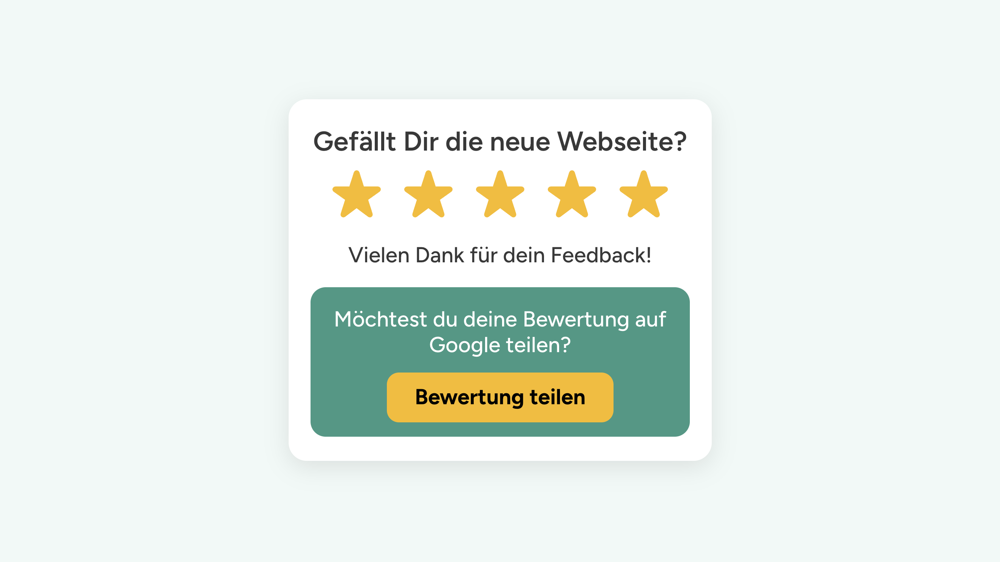
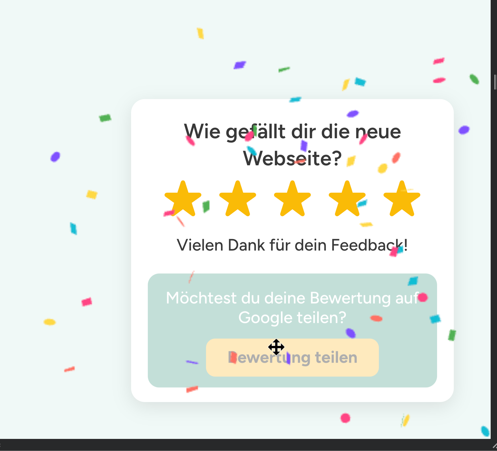
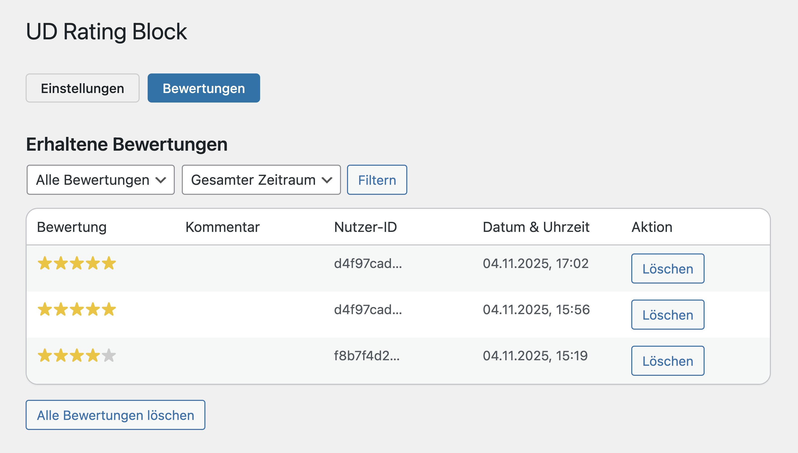

# UD Block: Rating

Interaktiver Bewertungs-Block mit 5-Sterne-System, REST-API-Anbindung, doppelter Bewertungslogik und automatischer Google-Weiterleitung.
Er ermöglicht echte Nutzerbewertungen direkt auf der Website und unterscheidet dabei bewusst zwischen **kritischem Feedback** (intern, mit Kommentar) und **positivem Feedback** (extern, Google-Weiterleitung).

## Funktionen

-   5-Sterne-Bewertung mit animiertem Hover-Effekt
-   Kommentarfeld bei niedriger Bewertung – wird lokal gespeichert
-   Automatische Google-Weiterleitung bei hoher Bewertung (zufällige 50/50-Verteilung zwischen Kunden- und Agenturprofil)
-   Doppelte Bewertungslogik (siehe unten)
-   Zeitgesteuerte Einblendung nach frei definierbarer Verzögerung
-   Begrenzung der Anzeigehäufigkeit pro Nutzer (z. B. max. 3 Mal)
-   Optionaler Confetti-Effekt beim Absenden
-   Speicherung aller Bewertungen in eigener Datenbanktabelle (`wp_ud_rating_reviews`)
-   Administrationsansicht mit Filterung und Löschoptionen
-   Umfassende Einstellungsseite im Backend
-   Kompatibel mit Full Site Editing (FSE)
-   Sicheres Sanitizing und Berechtigungsprüfung

## Screenshots

*Frontend-Ansicht des Bewertungs-Blocks.*

*Bewertungs-Block mit Confetti-Splash.*

*Backend-Ansicht mit gespeicherten Bewertungen und Filteroptionen.*

## Bewertungslogik (UX-Design)

Der Block unterscheidet zwei Szenarien:

### 1. Bewertung **unter** dem Mindestwert

-   Es erscheint **ein Kommentarfeld** („Möchtest du noch kurz etwas dazu sagen?“).
-   Nach dem Absenden werden **Sterne + Kommentar** lokal gespeichert.
-   Keine Weiterleitung zu Google.
-   Ziel: **Niedrigere Bewertungen intern behalten**, um echtes Feedback zu erhalten.

### 2. Bewertung **gleich oder über** dem Mindestwert

-   **Kein Kommentarfeld** (bewusste UX-Entscheidung – kein User füllt zweimal eine Textarea aus).
-   Die Sterne werden intern gespeichert.
-   Danach erfolgt **eine automatische Weiterleitung**:
    → mit 50 % Wahrscheinlichkeit zum **Google-Profil des Kunden** (Einstellung im Backend)
    → mit 50 % Wahrscheinlichkeit zum **Agentur-Profil von ulrich.digital** (Fallback-Konstante).

Diese Aufteilung sorgt für authentische Nutzerbewertungen und gleichzeitig faire Sichtbarkeit beider Profile.

## Admin-Einstellungen

Unter **Einstellungen → UD Rating Block** können u. a. konfiguriert werden:

### Allgemein

-   Entwicklermodus (unbegrenzte Test-Bewertungen)
-   Start- / Enddatum der Anzeige
-   Maximale Anzeigen pro Nutzer

### Darstellung & Verhalten

-   Verzögerung der Einblendung (Sekunden)
-   Eigenes CSS (automatisch im Frontend eingebunden)

### Texte & Beschriftungen

-   Frage an Nutzer
-   Dankestext
-   Platzhalter / Buttontexte für Kommentarbereich

### Bewertungslogik & Google-Link

-   Mindestbewertung für Google-Weiterleitung (Standard = 4 Sterne)
-   Aktivierung des Confetti-Effekts
-   Google-Profil-URL des Kunden
-   Texte für Frage + Button zur Google-Bewertung
-   Feste Fallback-Einträge von **ulrich.digital** (nur lesbar)

### Bewertungen

-   Listenansicht aller gesammelten Bewertungen
-   Filter nach Sternezahl oder Zeitraum (7 / 30 Tage)
-   Einzel- oder Komplettlöschung

### Datenschutz & Datenlöschung

Das Plugin speichert Bewertungen in einer eigenen Datenbanktabelle (`wp_ud_rating_reviews`).
Im Bereich **Verwaltung & System** kann festgelegt werden, ob beim späteren Deinstallieren des Plugins
auch alle gespeicherten Bewertungen entfernt werden sollen.

**Hinweis:**
Die Bewertungen bleiben standardmässig erhalten, bis sie manuell gelöscht werden.
Das Entfernen der Datensätze kann nicht rückgängig gemacht werden.

## Technische Details

-   **Block-Slug:** `ud/rating-block`
-   **Render-Modus:** dynamisch (PHP → `render.php`)
-   **REST-Routen:**
    -   `ud-rating/v1/submit` → Bewertung speichern
    -   `ud-rating/v1/stats` → Statistikdaten abrufen
-   **DB-Tabelle:** `wp_ud_rating_reviews`
-   **Fallback-Konstanten:**
    -   `UD_RATING_FALLBACK_LINK`
    -   `UD_RATING_FALLBACK_TEXT`
    -   `UD_RATING_FALLBACK_BUTTON`
-   **Frontend-Libs:**
    -   `@wordpress/icons`
    -   `canvas-confetti`
-   **Editor-Komponenten:**
    `TextControl`, `Button`, `PanelBody` … mit
    `__next40pxDefaultSize={true}` und `__nextHasNoMarginBottom={true}`
-   **Design:** SCSS-basiert, modulare Struktur, BEM-Namen (`ud-rating-block__stars`, `__question` …)
-   **Primärfarbe:** `$accent-500 = #fabb05`

## Autor

[ulrich.digital gmbh](https://ulrich.digital)

## Lizenz

Alle Rechte vorbehalten.
Dieses Plugin ist urheberrechtlich geschützt und darf ohne ausdrückliche schriftliche Genehmigung der **ulrich.digital gmbh** weder kopiert, verbreitet, verändert noch weiterverwendet werden.
