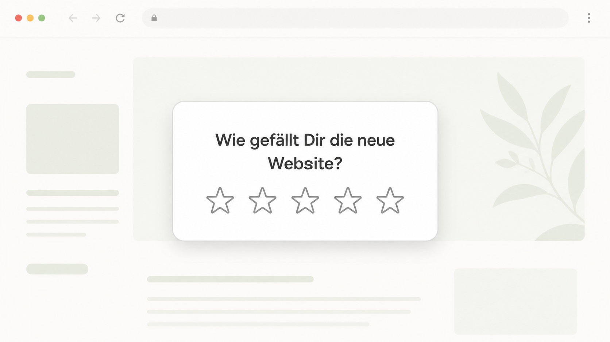
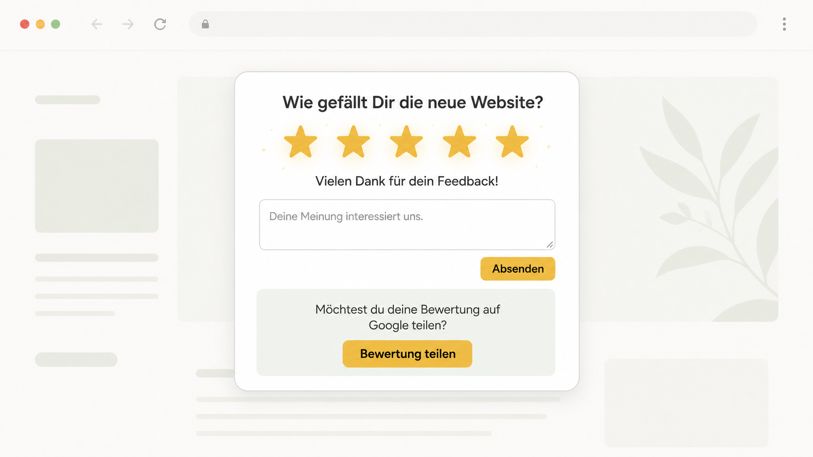
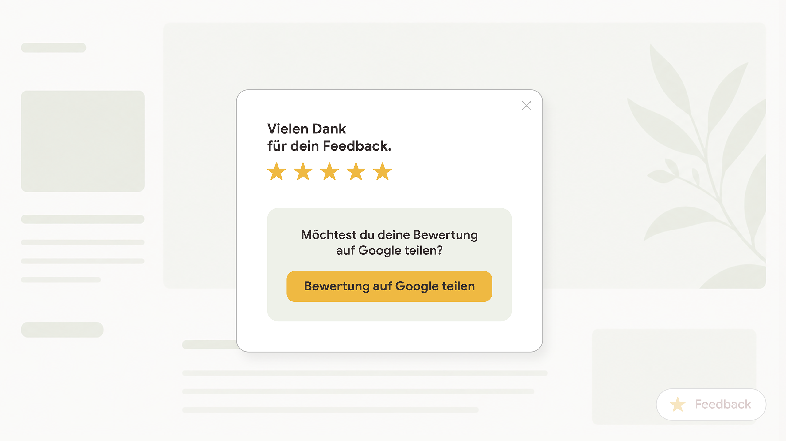
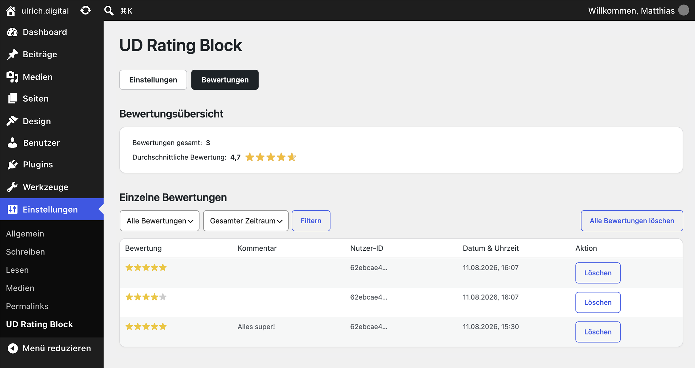

# UD Block: Rating

Interaktiver WordPress-Block für Sternebewertungen und ergänzende Kommentare. Bewertungen werden über eine REST-Schnittstelle in einer eigenen Datenbanktabelle gespeichert und im WordPress-Backend ausgewertet.

## Funktionen

- 5-Sterne-Bewertung mit Hover-Effekt
- Kompakter Feedback-Button als zeitgesteuerter Einstieg
- Optionales Kommentarfeld nach jeder Bewertung
- Eigener Google-Schritt nach übermitteltem Kommentar
- Zeitlich begrenzte und verzögerte Einblendung
- Optionale Star-Glow-Bestätigung nach erfolgreicher Speicherung
- Speicherung in einer eigenen Datenbanktabelle (`wp_ud_rating_reviews`)
- Administrationsansicht mit Durchschnitt, Filtern und Löschoptionen
- Konfigurierbare Texte und eigenes Frontend-CSS
- Dynamisches serverseitiges Rendering
- Unterstützung für Wide- und Full-Alignment

## Screenshots

*Frontend-Ansicht vor der Sterneauswahl.*

*Nach der Sterneauswahl verbindet der Dialog die Bewertung mit einem Kommentarfeld.*

*Nach dem übermittelten Kommentar erscheint die freiwillige Google-Verknüpfung.*

*Administrationsansicht mit Statistik, Filtern und Einzelbewertungen.*

## Ablauf im Frontend

Nach der konfigurierten Verzögerung erscheint rechts unten ein kompakter Feedback-Button. Er öffnet den zentralen Bewertungsdialog mit Frage und Sternen. Die Auswahl eines Sternwerts wird direkt gespeichert und führt zum Kommentarfeld. Nach einem übermittelten Kommentar erscheint der eigenständige Google-Schritt.

Der Google-Link öffnet sich in einem neuen Tab; der Bewertungsdialog schliesst sich zwei Sekunden später. Über die Schliessen-Schaltfläche oder die Escape-Taste lässt sich der Dialog jederzeit schliessen.

Ist ein Unternehmensprofil hinterlegt, ordnet das Plugin den Google-Link zu gleichen Teilen dem Website-Betreiber oder ulrich.digital als umsetzender Agentur zu. Die Sternezahl beeinflusst diese Zuordnung und die Sichtbarkeit des Links nicht. Fehlt der Link des Website-Betreibers, wird das Agenturprofil verwendet.

Eine zufällig erzeugte Browser-ID wird im Local Storage und als Cookie gespeichert. Damit erkennt das serverseitige Rendering, ob dieser Browser bereits eine Bewertung abgegeben hat. Der Entwicklermodus erlaubt wiederholte Bewertungen zu Testzwecken.

## Einstellungen

Unter **Einstellungen → UD Rating Block** lassen sich folgende Bereiche konfigurieren:

### Anzeigezeitraum

- Startdatum
- Enddatum
- Verzögerung der Einblendung in Sekunden

### Texte und Benutzerführung

- Frage an die Nutzer
- Text des Feedback-Buttons
- Dankestext
- Platzhalter für das Kommentarfeld
- Beschriftung der Absende-Schaltfläche

### Google-Verknüpfung und Attribution

- URL des Google-Unternehmensprofils
- Begleittext
- Beschriftung des Links
- fest hinterlegte Angaben von ulrich.digital für die Agentur-Zuordnung

Der Link wird nach einem übermittelten Kommentar angeboten. Die Veröffentlichung einer Google-Rezension bleibt eine freiwillige, separate Handlung.

### Darstellung und Verwaltung

- Star-Glow-Bestätigung mit Rücksicht auf `prefers-reduced-motion`
- eigenes Frontend-CSS
- Entwicklermodus
- Löschen der Bewertungsdaten bei der Deinstallation

## Auswertung

Die Registerkarte **Bewertungen** zeigt:

- Gesamtzahl und durchschnittliche Sternebewertung
- Filter nach Sternezahl
- Filter für die letzten 7 oder 30 Tage
- Sterne, Kommentare, gekürzte Browser-ID und Zeitpunkt
- Funktionen zum einzelnen oder vollständigen Löschen der Einträge

## Technische Details

- **Block-Slug:** `ud/rating-block`
- **Render-Modus:** dynamisch über `includes/render.php`
- **REST-Routen:**
  - `POST /ud-rating/v1/submit`
  - `GET /ud-rating/v1/list`
  - `GET /ud-rating/v1/stats`
- **Datenbanktabelle:** `wp_ud_rating_reviews`
- **Attributionsangaben:** `UD_RATING_FALLBACK_LINK`, `UD_RATING_FALLBACK_TEXT`, `UD_RATING_FALLBACK_BUTTON`
- **Frontend-Bibliothek:** `@wordpress/api-fetch`
- **Styles:** SCSS mit BEM-Klassennamen

## Einblicke in die Umsetzung

Der Beitrag gibt Einblick in die entwickelte Lösung und ihre Funktionsweise.

- **Mehr zur Lösung:** [Sternebewertungen und Kommentare in WordPress strukturiert erfassen](https://ulrich.digital/sternebewertungen-und-kommentare-in-wordpress-strukturiert-erfassen/)

## Autor

[ulrich.digital gmbh](https://ulrich.digital)

## Lizenz

Dieses Projekt steht unter der [ulrich.digital Nutzungslizenz 1.0](LICENSE).

Die unveränderte Software darf in eigenen und kommerziellen Projekten eingesetzt werden. Auf jeder öffentlich erreichbaren Website oder Anwendung muss [ulrich.digital gmbh](https://ulrich.digital) im Impressum, in einem Credits-Bereich oder auf einer vergleichbaren Informationsseite genannt werden. Verkauf, eigenständige Weitergabe, Unterlizenzierung und Änderungen bedürfen der vorherigen schriftlichen Zustimmung von ulrich.digital gmbh.

Komponenten Dritter behalten ihre jeweiligen Lizenz- und Nutzungsbedingungen.
