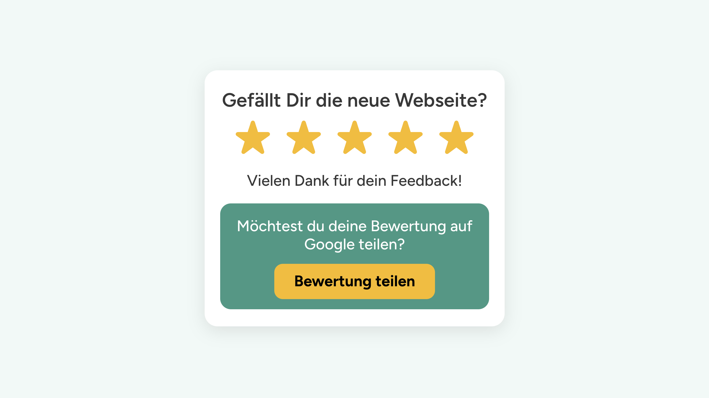
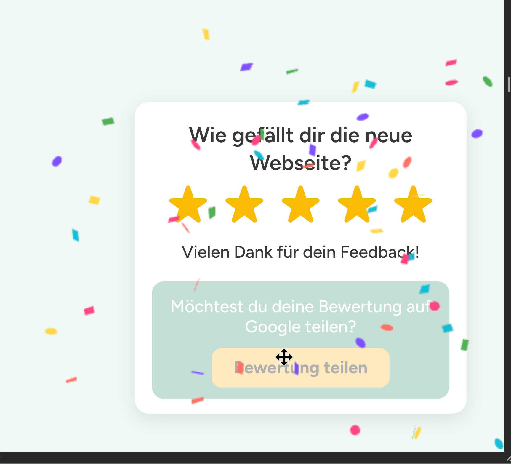
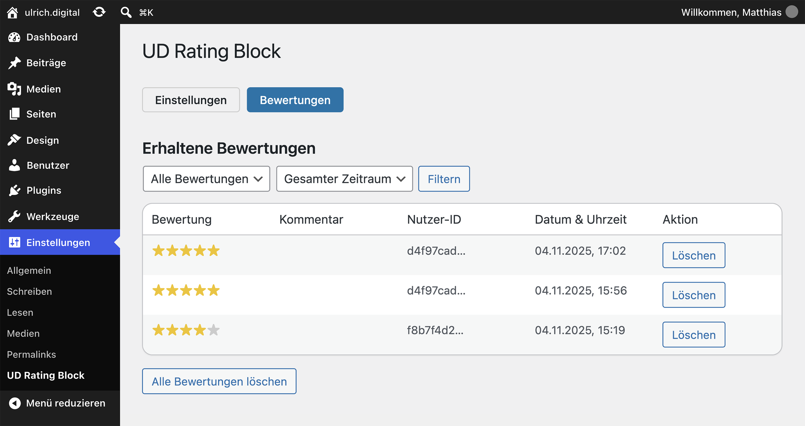

# UD Block: Rating

Interaktiver WordPress-Block für Sternebewertungen und ergänzende Kommentare. Bewertungen werden über eine REST-Schnittstelle in einer eigenen Datenbanktabelle gespeichert und im WordPress-Backend ausgewertet.

## Funktionen

- 5-Sterne-Bewertung mit Hover-Effekt
- Optionales Kommentarfeld nach jeder Bewertung
- Optionaler Google-Link zum Website-Betreiber oder zu ulrich.digital nach jeder Bewertung
- Zeitlich begrenzte und verzögerte Einblendung
- Optionaler Konfetti-Effekt nach erfolgreicher Speicherung
- Speicherung in einer eigenen Datenbanktabelle (`wp_ud_rating_reviews`)
- Administrationsansicht mit Durchschnitt, Filtern und Löschoptionen
- Konfigurierbare Texte und eigenes Frontend-CSS
- Dynamisches serverseitiges Rendering
- Unterstützung für Wide- und Full-Alignment

## Screenshots

*Frontend-Ansicht des Bewertungsdialogs.*

*Optionale Konfetti-Animation nach der Speicherung.*

*Administrationsansicht mit Statistik, Filtern und Einzelbewertungen.*

## Ablauf im Frontend

Nach der Auswahl eines Sternwerts speichert das Plugin die Bewertung direkt. Anschliessend stehen allen Nutzern dieselben optionalen Möglichkeiten zur Verfügung:

- einen ergänzenden Kommentar übermitteln
- die eigene Erfahrung über den angezeigten Link auf Google teilen

Ist ein Unternehmensprofil hinterlegt, ordnet das Plugin den Google-Link zu gleichen Teilen dem Website-Betreiber oder ulrich.digital als umsetzender Agentur zu. Die Sternezahl beeinflusst diese Zuordnung und die Sichtbarkeit des Links nicht. Fehlt der Link des Website-Betreibers, wird das Agenturprofil verwendet.

Eine zufällig erzeugte Browser-ID wird im Local Storage und als Cookie gespeichert. Damit erkennt das serverseitige Rendering, ob dieser Browser bereits eine Bewertung abgegeben hat. Der Entwicklermodus erlaubt wiederholte Bewertungen zu Testzwecken.

## Einstellungen

Unter **Einstellungen → UD Rating Block** lassen sich folgende Bereiche konfigurieren:

### Anzeigezeitraum

- Startdatum
- Enddatum
- Verzögerung der Einblendung in Sekunden

### Texte und Benutzerführung

- Frage an die Nutzer
- Dankestext
- Platzhalter und Bestätigungstext für Kommentare
- Beschriftung der Absende-Schaltfläche

### Google-Verknüpfung und Attribution

- URL des Google-Unternehmensprofils
- Begleittext
- Beschriftung des Links
- fest hinterlegte Angaben von ulrich.digital für die Agentur-Zuordnung

Der Link wird nach jeder Sternebewertung angeboten. Die Veröffentlichung einer Google-Rezension bleibt eine freiwillige, separate Handlung.

### Darstellung und Verwaltung

- Konfetti-Animation
- eigenes Frontend-CSS
- Entwicklermodus
- Löschen der Bewertungsdaten bei der Deinstallation

## Auswertung

Die Registerkarte **Bewertungen** zeigt:

- Gesamtzahl und durchschnittliche Sternebewertung
- Filter nach Sternezahl
- Filter für die letzten 7 oder 30 Tage
- Sterne, Kommentare, gekürzte Browser-ID und Zeitpunkt
- Funktionen zum einzelnen oder vollständigen Löschen der Einträge

## Technische Details

- **Block-Slug:** `ud/rating-block`
- **Render-Modus:** dynamisch über `includes/render.php`
- **REST-Routen:**
  - `POST /ud-rating/v1/submit`
  - `GET /ud-rating/v1/list`
  - `GET /ud-rating/v1/stats`
- **Datenbanktabelle:** `wp_ud_rating_reviews`
- **Attributionsangaben:** `UD_RATING_FALLBACK_LINK`, `UD_RATING_FALLBACK_TEXT`, `UD_RATING_FALLBACK_BUTTON`
- **Frontend-Bibliotheken:** `@wordpress/api-fetch`, `canvas-confetti`
- **Styles:** SCSS mit BEM-Klassennamen

## Autor

[ulrich.digital gmbh](https://ulrich.digital)

## Lizenz

Alle Rechte vorbehalten. Dieses Plugin ist urheberrechtlich geschützt und darf nur mit ausdrücklicher schriftlicher Genehmigung der ulrich.digital gmbh kopiert, verbreitet, verändert oder weiterverwendet werden.
